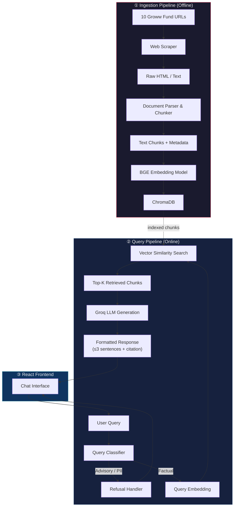
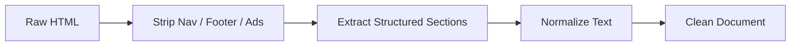
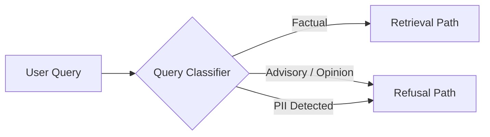
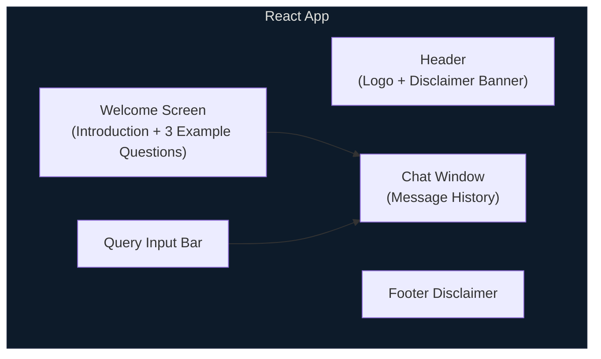
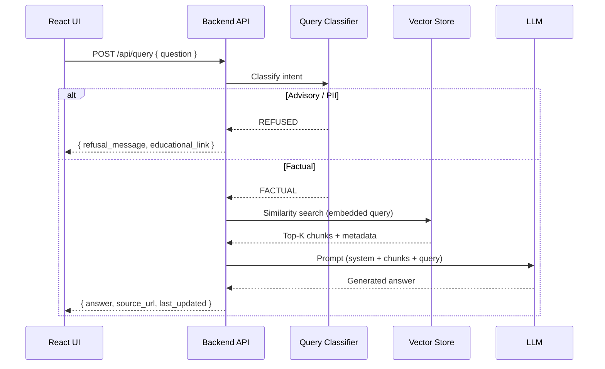
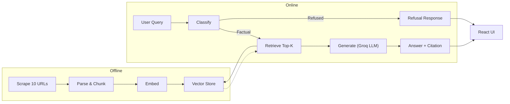

# Architecture — Zero-Advice Fund RAG

> Detailed technical architecture for the facts-only mutual fund FAQ assistant.
> Derived from [context.md](file:///c:/Users/panka/Documents/Pankaj_CodeSpace/AI_Projects/zero-advice-fund-rag/docs/context.md).

---

## High-Level Overview



The system is divided into three major layers:

| Layer | Mode | Purpose |
|-------|------|---------|
| **Ingestion Pipeline** | Offline / batch | Scrape, parse, chunk, embed, and index the corpus |
| **Query Pipeline** | Online / real-time | Classify query → retrieve context → generate answer |
| **React Frontend** | Online / real-time | Chat UI with disclaimers and example questions |

---

## ① Ingestion Pipeline (Offline)

The ingestion pipeline runs as a one-time (or periodic) batch job to build the vector index from the 10 Groww fund page URLs.

### 1.1 Web Scraping

| Aspect | Detail |
|--------|--------|
| **Input** | 10 Groww mutual fund URLs (ICICI Prudential × 5, HDFC × 5) |
| **Tool** | Python-based scraper (e.g., `requests` + `BeautifulSoup`, or `Playwright` for JS-rendered content) |
| **Output** | Raw HTML / structured text per fund page |
| **Metadata captured** | URL, AMC name, scheme name, category, scrape timestamp |

> [!IMPORTANT]
> Groww pages are JavaScript-heavy. If key data (expense ratio tables, fund details) is client-rendered, use a headless browser (Playwright / Selenium) instead of plain HTTP requests.

### 1.2 Document Parsing & Cleaning



- **HTML parsing**: Extract meaningful content blocks — fund overview, expense ratio, exit load, SIP details, risk classification, benchmark, fund manager, etc.
- **Section tagging**: Tag each extracted block with its section type (e.g., `expense_ratio`, `exit_load`, `fund_manager`) for richer metadata.
- **Cleaning**: Remove boilerplate navigation, advertisements, footers, and duplicate content.

### 1.3 Chunking Strategy

| Parameter | Value | Rationale |
|-----------|-------|-----------|
| **1-to-1 Mapping** | For sections < 1000 tokens | Keeps small sections (like Expense Ratio, Exit Load) fully intact |
| **Table Splitting** | Row-based split + header | Large tables (e.g., Holdings > 3000 tokens) are split by rows, with the table header prepended to every chunk to maintain context |
| **Text Splitting** | Paragraphs with overlap | Large text sections (> 1000 chars) are split logically to fit within the ~500 token limit of BGE |
| **Metadata Prefixing**| `[Fund Name - Section]` | Prepending this to chunk text improves the BGE embedding semantic representation |


Each chunk carries metadata:

```json
{
  "chunk_id": "icici-largecap-expense-001",
  "source_url": "https://groww.in/mutual-funds/icici-prudential-large-cap-fund-direct-growth",
  "amc": "ICICI Prudential",
  "scheme": "ICICI Prudential Large Cap Fund – Direct Growth",
  "category": "Large Cap",
  "section": "expense_ratio",
  "scraped_at": "2026-06-30T00:00:00Z"
}
```

### 1.4 Embedding (BGE)

| Aspect | Detail |
|--------|--------|
| **Model** | `BAAI/bge-small-en-v1.5` (or `bge-base-en-v1.5` for higher accuracy) |
| **Dimension** | 384 (`bge-small`) / 768 (`bge-base`) |
| **Cost** | **Free** — runs locally via `sentence-transformers` |
| **Input** | Each text chunk (prepend `"Represent this sentence: "` for optimal results) |
| **Output** | Dense vector per chunk |

### 1.5 Vector Store (ChromaDB)

| Aspect | Detail |
|--------|--------|
| **Store** | **ChromaDB** (lightweight, local, open-source) |
| **Cost** | **Free** |
| **Index type** | HNSW (approximate nearest neighbor) |
| **Persistence** | Stored on disk; rebuilt on re-ingestion |
| **Collections** | Single collection; filtered by metadata at query time if needed |

---

## ② Query Pipeline (Online)

This pipeline runs on every user query in real-time.

### 2.1 Query Classification

Before retrieval, every incoming query passes through a **classifier** that routes it to one of two paths:



| Classification | Examples | Action |
|----------------|----------|--------|
| **Factual** | "What is the expense ratio of HDFC Mid-Cap Fund?" | Proceed to retrieval |
| **Advisory** | "Should I invest in ICICI Flexicap?" / "Which is better?" | Return polite refusal + educational link |
| **PII** | Query contains PAN, Aadhaar, account number, OTP, email, phone | Return privacy refusal; do **not** log the query |

**Implementation options:**

- **Keyword / rule-based**: Fast; catches obvious advisory patterns ("should I", "better", "recommend").
- **LLM-based classifier**: Use a lightweight prompt to classify intent. More robust for edge cases.
- **Hybrid**: Rules first, LLM fallback for ambiguous queries.

### 2.2 Retrieval

| Aspect | Detail |
|--------|--------|
| **Query embedding** | Same BGE model as ingestion (prepend `"Represent this sentence for searching relevant passages: "` to query) |
| **Search** | Cosine similarity over ChromaDB |
| **Top-K** | Retrieve top 3–5 chunks |
| **Metadata filter** | Optionally filter by AMC or scheme if detected in the query |
| **Re-ranking** (optional) | Cross-encoder re-ranker (e.g., `bge-reranker-base`, free & local) |

### 2.3 LLM Generation (Groq)

| Aspect | Detail |
|--------|--------|
| **Provider** | **Groq** (free tier API) |
| **Model** | `llama-3.3-70b-versatile`, `mixtral-8x7b-32768`, or equivalent available on Groq |
| **Cost** | **Free** — Groq offers a generous free tier with rate limits |
| **Prompt strategy** | System prompt + retrieved chunks + user query |
| **Temperature** | Low (0.0–0.2) for factual accuracy |
| **Output constraints** | ≤ 3 sentences; exactly 1 citation link; mandatory footer |

#### System Prompt (Template)

```text
You are a facts-only mutual fund FAQ assistant. You MUST:
1. Answer ONLY from the provided context. Never fabricate information.
2. Keep your response to a MAXIMUM of 3 sentences.
3. Include EXACTLY ONE citation link (the source_url from the context).
4. End every response with: "Last updated from sources: <scraped_at date> <source_url>"
5. NEVER provide investment advice, opinions, or recommendations.
6. NEVER compare fund performance or calculate returns.
7. If the context does not contain the answer, say so honestly.

CONTEXT:
{retrieved_chunks}

USER QUESTION:
{user_query}
```

### 2.4 Refusal Handler

When the classifier routes a query to the refusal path:

```text
Response template:
"I can only provide factual information about mutual fund schemes,
such as expense ratios, exit loads, or SIP minimums. I'm unable to
offer investment advice or recommendations. For investment guidance,
visit [AMFI](https://www.amfiindia.com/) or consult a SEBI-registered
financial advisor."
```

---

## ③ React Frontend

### 3.1 UI Components



| Component | Description |
|-----------|-------------|
| **Header** | App title, minimal branding, persistent disclaimer: *"Facts-only. No investment advice."* |
| **Welcome Screen** | Short introduction + 3 clickable example questions |
| **Chat Window** | Scrollable message history (user bubbles + assistant bubbles with citations) |
| **Query Input** | Text input with send button; disabled during loading |
| **Response Card** | Formatted answer with citation link and "Last updated" footer |
| **Footer** | Persistent disclaimer visible at all times |

### 3.2 Example Questions (Welcome Screen)

1. *"What is the expense ratio of ICICI Prudential Large Cap Fund?"*
2. *"What is the exit load for HDFC Small Cap Fund?"*
3. *"What is the minimum SIP amount for ICICI Prudential ELSS Tax Saver?"*

### 3.3 Frontend ↔ Backend Communication



---

## API Design

### Endpoint

```
POST /api/query
```

#### Request

```json
{
  "question": "What is the expense ratio of HDFC Mid-Cap Fund?"
}
```

#### Response — Factual

```json
{
  "status": "success",
  "type": "factual",
  "answer": "The expense ratio of HDFC Mid-Cap Fund (Direct Growth) is 0.75% as of the latest factsheet.",
  "source_url": "https://groww.in/mutual-funds/hdfc-mid-cap-fund-direct-growth",
  "last_updated": "2026-06-30"
}
```

#### Response — Refusal

```json
{
  "status": "success",
  "type": "refusal",
  "answer": "I can only provide factual information about mutual fund schemes. For investment guidance, please visit AMFI or consult a SEBI-registered financial advisor.",
  "educational_link": "https://www.amfiindia.com/"
}
```

### Endpoint — Supported Funds

```
GET /api/funds
```

#### Response

```json
{
  "funds": [
    { "name": "ICICI Prudential Large Cap Fund – Direct Growth", "type": "Equity • Large Cap" },
    { "name": "HDFC Mid-Cap Opportunities Fund – Direct Growth", "type": "Equity • Mid Cap" }
  ]
}
```

> This endpoint dynamically reads `backend/ingestion/parsed_data.json` to extract unique scheme names and categories. Results are cached in memory after the first call.

---

## Tech Stack Summary (All Free / Open-Source)

| Layer | Technology | Cost | Purpose |
|-------|-----------|------|---------|
| **Scraping** | Python (`requests` / `BeautifulSoup` / `Playwright`) | Free | Extract fund data from Groww pages |
| **Chunking** | LangChain `RecursiveCharacterTextSplitter` or custom | Free | Split documents into retrieval-friendly chunks |
| **Embedding** | **BGE** (`BAAI/bge-small-en-v1.5`) via `sentence-transformers` | Free | Convert text → dense vectors (runs locally) |
| **Vector Store** | **ChromaDB** | Free | Store and search embeddings (local, persistent) |
| **LLM** | **Groq** (`llama-3.3-70b-versatile` / `mixtral-8x7b-32768`) | Free tier | Generate factual answers from context |
| **Backend API** | Python (FastAPI) | Free | Serve the query pipeline as a REST API |
| **Frontend** | React (Vite) | Free | Chat-based user interface |
| **Orchestration** | LangChain (optional) | Free | Chain retrieval + generation steps |

---

## Directory Structure (Proposed)

```
zero-advice-fund-rag/
├── docs/
│   ├── problemStatement.txt
│   ├── context.md
│   └── architecture.md          ← this file
├── backend/
│   ├── scraper/
│   │   ├── scrape.py            # Scrape Groww fund pages
│   │   └── urls.json            # List of 10 fund URLs
│   ├── ingestion/
│   │   ├── parser.py            # HTML → clean text
│   │   ├── chunker.py           # Text → chunks with metadata
│   │   └── embedder.py          # Chunks → vectors → store
│   ├── query/
│   │   ├── classifier.py        # Factual vs advisory vs PII
│   │   ├── retriever.py         # Vector similarity search
│   │   └── generator.py         # LLM prompt + response formatting
│   ├── api/
│   │   ├── __init__.py
│   │   └── main.py              # FastAPI app (POST /api/query, GET /api/funds)
│   ├── vectorstore/             # Persisted ChromaDB index
│   ├── config.py                # API keys, model config, thresholds
│   └── requirements.txt
├── frontend/
│   ├── src/
│   │   ├── App.jsx
│   │   ├── components/
│   │   │   ├── ChatWindow.jsx
│   │   │   ├── MessageBubble.jsx
│   │   │   ├── QueryInput.jsx
│   │   │   ├── WelcomeScreen.jsx
│   │   │   └── DisclaimerBanner.jsx
│   │   └── index.css
│   ├── package.json
│   └── vite.config.js
├── LICENSE
└── README.md
```

---

## Data Flow Summary



---

## Security & Compliance Guardrails

| Guardrail | Implementation |
|-----------|---------------|
| **No PII storage** | Query classifier rejects PII before any processing; queries containing PII are never logged |
| **No advisory content** | System prompt + classifier enforce facts-only responses |
| **No return calculations** | System prompt explicitly prohibits performance comparisons; link to factsheet instead |
| **Source transparency** | Every response includes source URL and last-updated timestamp |
| **Data provenance** | Only the 10 Groww fund page URLs are indexed — no PDFs or external documents |

---

## Known Limitations & Risks

| Risk | Mitigation |
|------|------------|
| Groww pages may change structure | Monitor scraper output; re-run ingestion periodically |
| JS-rendered content may be missed | Use headless browser (Playwright) for scraping |
| Stale data in vector store | Track `scraped_at` timestamp; surface it in the response footer |
| LLM hallucination | Low temperature + strict system prompt + retrieved-context-only answering |
| Ambiguous queries | LLM classifier may misroute; hybrid rule + LLM approach reduces errors |

---

*Source: [context.md](file:///c:/Users/panka/Documents/Pankaj_CodeSpace/AI_Projects/zero-advice-fund-rag/docs/context.md)*
