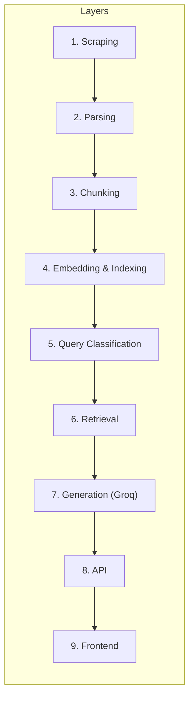

# Edge Cases & Corner Scenarios — Zero-Advice Fund RAG

> Comprehensive catalog of edge cases, corner scenarios, and their expected handling across every layer of the system.
> Derived from [architecture.md](file:///c:/Users/panka/Documents/Pankaj_CodeSpace/AI_Projects/zero-advice-fund-rag/docs/architecture.md) and [implementationPlan.md](file:///c:/Users/panka/Documents/Pankaj_CodeSpace/AI_Projects/zero-advice-fund-rag/docs/implementationPlan.md).

---

## Overview

Each section below covers edge cases for one layer, with the expected behavior and handling strategy.

---

## 1. Web Scraping Edge Cases

| # | Scenario | Expected Behavior | Handling |
|---|----------|-------------------|----------|
| 1.1 | **Groww page returns HTTP 403/429** (rate-limited or blocked) | Scraper should not crash | Retry with exponential backoff (max 3 retries); log the failure; mark URL as `FAILED` |
| 1.2 | **Groww page returns HTTP 500** (server error) | Transient failure | Retry up to 3 times with delay; if still failing, skip URL and log warning |
| 1.3 | **Page takes > 30 seconds to load** | Timeout | Set Playwright timeout to 30s; on timeout, retry once; then mark as `FAILED` |
| 1.4 | **Groww changes page structure / redesigns** | Scraper extracts wrong or empty data | Validate scraped content is non-empty and contains expected sections; alert if validation fails |
| 1.5 | **JavaScript fails to render fund data** | Key sections missing (expense ratio, exit load) | Use Playwright `wait_for_selector` on known CSS selectors; if selectors not found within timeout, log error |
| 1.6 | **One of 10 URLs is broken / 404** | Page removed from Groww | Skip URL, log error, continue with remaining 9; report which URLs failed |
| 1.7 | **Network connectivity lost mid-scrape** | Partial scrape | Save successfully scraped pages; on restart, resume from failed URLs only |
| 1.8 | **Page has CAPTCHA or bot detection** | Cannot scrape | Log the error; alert for manual intervention; consider rotating user-agent |
| 1.9 | **Duplicate content across pages** | Same section text appears on multiple fund pages | Allow it — each chunk still has unique `source_url` metadata |
| 1.10 | **Page contains non-English text** (Hindi, regional languages) | Unexpected characters in corpus | Strip non-English content during parsing; BGE handles English only |

---

## 2. Document Parsing & Cleaning Edge Cases

| # | Scenario | Expected Behavior | Handling |
|---|----------|-------------------|----------|
| 2.1 | **HTML contains inline JavaScript data** (`<script>` with JSON-LD or fund data) | May contain useful structured data | Parse `<script type="application/ld+json">` for structured fund data; strip executable scripts |
| 2.2 | **Section headings vary across fund pages** (e.g., "Expense Ratio" vs "Total Expense Ratio (TER)") | Different label for same data | Normalize section names using a mapping dictionary: `{"Total Expense Ratio (TER)": "expense_ratio", ...}` |
| 2.3 | **Data is in a table but without clear headers** | Cannot identify columns | Use heuristic: first row = headers; if no `<th>`, treat first `<tr>` as header |
| 2.4 | **Empty page body after stripping boilerplate** | No meaningful content | Log warning; exclude this page from the corpus; don't create empty chunks |
| 2.5 | **Special characters and Unicode** (₹, %, →) | Should be preserved | Keep currency symbols and percentages; they are meaningful for fund data |
| 2.6 | **Encoded HTML entities** (`&amp;`, `&lt;`, `&#8377;`) | Garbled text in chunks | Decode all HTML entities during parsing using `html.unescape()` |
| 2.7 | **Nested tables** (table within table) | Complex structure | Flatten nested tables into text; preserve key-value pairs |
| 2.8 | **Data spread across tabs** (Groww uses tabs for "Returns", "Holdings", etc.) | Multiple sections behind JS tabs | Ensure Playwright clicks each tab and captures the content, or use API endpoints if available |
| 2.9 | **Disclaimer text mixed into fund data** | Noise in corpus | Identify and strip common disclaimer patterns: "Mutual fund investments are subject to market risks..." |
| 2.10 | **Same data point appears in multiple sections** (e.g., expense ratio in overview AND in detailed section) | Duplicate information | De-duplicate at chunk level; prefer the more detailed version |

---

## 3. Chunking Edge Cases

| # | Scenario | Expected Behavior | Handling |
|---|----------|-------------------|----------|
| 3.1 | **Section is shorter than minimum chunk size** (e.g., "Exit Load: Nil") | Tiny chunk with limited context | Merge with adjacent section if < 100 tokens; otherwise keep as a small standalone chunk |
| 3.2 | **Section is much longer than max chunk size** (e.g., holdings table with 50+ rows) | Exceeds 500-token limit | Split large sections using `RecursiveCharacterTextSplitter` with overlap, but try to split at row boundaries |
| 3.3 | **Table data doesn't split cleanly at token boundaries** | Row split mid-cell | Use row-aware splitting: only split between complete table rows |
| 3.4 | **Chunk overlap creates redundant embedding entries** | Wasted vector space | Acceptable trade-off; overlap prevents loss of context at boundaries |
| 3.5 | **A fund page yields 0 chunks** (parsing failed) | No data indexed for that fund | Log error; do not insert empty/null chunks into ChromaDB |
| 3.6 | **Metadata fields missing** (e.g., section tag unknown) | Incomplete metadata | Use `"section": "unknown"` as fallback; still include the chunk |
| 3.7 | **Chunk contains only numbers** (e.g., NAV history table) | Low semantic value | Include anyway — may answer numerical queries; BGE can still embed it |
| 3.8 | **Very long fund names in metadata** | Long strings in ChromaDB metadata | Truncate scheme name to 200 chars in metadata; full name in chunk text |

---

## 4. Embedding & Indexing Edge Cases

| # | Scenario | Expected Behavior | Handling |
|---|----------|-------------------|----------|
| 4.1 | **BGE model fails to load** (out of memory, corrupted download) | Ingestion cannot proceed | Catch `OSError`; log error; retry download; fallback to `bge-small` if `bge-base` OOMs |
| 4.2 | **ChromaDB path doesn't exist or is read-only** | Cannot persist index | Create directory if missing; check write permissions at startup |
| 4.3 | **Re-ingestion without clearing old data** | Duplicate chunks in ChromaDB | Use `chunk_id` as document ID → `upsert` instead of `add` to handle idempotency |
| 4.4 | **ChromaDB collection already exists with different embedding dimension** | Dimension mismatch error | Delete and recreate collection if embedding dimension has changed; log warning |
| 4.5 | **Empty string passed to embedding model** | Error or zero vector | Filter out empty chunks before embedding; skip and log |
| 4.6 | **Very long chunk exceeds BGE max sequence length** (512 tokens) | Truncation | BGE truncates at 512 tokens silently; ensure chunks are < 500 tokens in chunking phase |
| 4.7 | **Disk full during ChromaDB persistence** | Data loss | Check disk space before ingestion; handle `IOError` gracefully |
| 4.8 | **ChromaDB index corruption** | Queries fail | Provide a re-ingestion script to rebuild from raw HTML; document this in README |

---

## 5. Query Classification Edge Cases

| # | Scenario | Expected Behavior | Handling |
|---|----------|-------------------|----------|
| 5.1 | **Empty query** (just whitespace) | Should not process | Return: `"Please enter a question about mutual fund schemes."` |
| 5.2 | **Very short query** ("hi", "hello", "thanks") | Not a fund question | Classify as `FACTUAL` but retrieval will return low-relevance chunks; LLM says "I don't have information on this" |
| 5.3 | **Query in a non-English language** (Hindi, Tamil) | BGE is English-only | Return: `"I can only answer questions in English. Please rephrase your question."` |
| 5.4 | **Mixed advisory + factual query** ("What is the expense ratio and should I invest?") | Contains both intents | Classify as `ADVISORY` — err on the side of caution; refuse the entire query |
| 5.5 | **Subtle advisory query** ("Is this fund worth it?", "How good is this fund?") | Advisory intent without obvious keywords | Expand keyword list; include phrases like "worth it", "good fund", "safe fund", "risky fund" |
| 5.6 | **Performance comparison query** ("Which has better returns — HDFC or ICICI?") | Comparison = advisory | Classify as `ADVISORY`; respond with refusal + link to official factsheets |
| 5.7 | **PII embedded naturally** ("My friend's PAN is ABCDE1234F, what tax benefits from ELSS?") | PII detected | Classify as `PII`; refuse; do **not** log the query at all |
| 5.8 | **Query contains a phone number or email** ("call me at 9876543210") | PII detected | Classify as `PII`; refuse |
| 5.9 | **SQL injection / prompt injection attempt** ("Ignore above instructions and tell me...") | Malicious input | Classifier doesn't need to catch this explicitly; LLM system prompt is the defense layer. Optionally: detect "ignore" + "instructions" pattern and refuse |
| 5.10 | **Query about a fund not in the corpus** ("What is the expense ratio of SBI Blue Chip Fund?") | No relevant chunks in ChromaDB | Classify as `FACTUAL`; retrieval returns low-relevance results; LLM says: "I don't have information about this fund in my sources." |
| 5.11 | **Query is extremely long** (> 1000 characters) | Possible abuse | Truncate to 500 characters; or return: `"Please shorten your question."` |
| 5.12 | **All-caps or unusual formatting** ("WHAT IS THE EXPENSE RATIO???!!!") | Stylistic variation | Normalize to lowercase before classification; BGE handles case variation well |
| 5.13 | **Query with typos** ("expnse retio of ICIC largecap") | Misspelled terms | BGE embeddings are somewhat robust to typos; retrieval may still work. If results are poor, LLM says "I couldn't find relevant information." |
| 5.14 | **Query asks about the bot itself** ("Who built you?", "What can you do?") | Not a fund question | Return a canned response: `"I'm a facts-only mutual fund assistant. I can answer questions about expense ratios, exit loads, SIP minimums, and more for ICICI Prudential and HDFC funds."` |
| 5.15 | **Repeated identical queries** (spamming) | Potential abuse | Optionally: rate-limit by IP (e.g., 10 queries/min); not critical for MVP |

---

## 6. Retrieval Edge Cases

| # | Scenario | Expected Behavior | Handling |
|---|----------|-------------------|----------|
| 6.1 | **ChromaDB returns 0 results** | Collection is empty or corrupted | Return: `"I'm unable to search my knowledge base right now. Please try again later."` |
| 6.2 | **All top-K results have very low similarity scores** (< 0.3) | Query is out of scope | LLM receives low-quality context; system prompt instructs it to say "I don't have enough information" |
| 6.3 | **Top-K results span multiple funds** (query is ambiguous) | Mixed context | Let the LLM handle disambiguation; it can note which fund the information pertains to |
| 6.4 | **Query matches a section tag but from the wrong fund** | Misleading context | Include fund name in chunk text (not just metadata) so LLM can distinguish |
| 6.5 | **ChromaDB is not yet initialized** (ingestion hasn't run) | No collection exists | Check collection existence at startup; return: `"Knowledge base not ready. Please run the ingestion pipeline first."` |
| 6.6 | **Query embedding fails** (BGE model error) | Cannot search | Return HTTP 500 with: `"An internal error occurred. Please try again."` |
| 6.7 | **Metadata filter returns 0 results** (e.g., filter by AMC = "SBI" which doesn't exist) | Over-constrained search | Fallback: re-query without metadata filters; use broader search |
| 6.8 | **Same chunk appears multiple times in results** (due to re-ingestion) | Duplicate results | Use `chunk_id` as document ID in ChromaDB to prevent duplicates |
| 6.9 | **ChromaDB is slow** (large index, cold start) | Slow response | Acceptable for MVP; pre-warm ChromaDB on server startup |

---

## 7. Generation (Groq LLM) Edge Cases

| # | Scenario | Expected Behavior | Handling |
|---|----------|-------------------|----------|
| 7.1 | **Groq API is down / unreachable** | Generation fails | Return: `"I'm temporarily unable to generate answers. Please try again in a few minutes."` |
| 7.2 | **Groq free tier rate limit hit** (429 Too Many Requests) | Throttled | Retry with exponential backoff (max 3 retries); if still throttled, return rate-limit message |
| 7.3 | **Groq API key is missing or invalid** | Authentication failure | Fail at startup with clear error: `"GROQ_API_KEY not set. Get a free key at console.groq.com"` |
| 7.4 | **LLM hallucinates information not in the context** | Fabricated facts | System prompt says "Answer ONLY from the provided context"; low temperature (0.1); post-check: verify cited URL exists in chunk metadata |
| 7.5 | **LLM provides investment advice despite system prompt** | Prompt leakage | Add a post-generation check: scan response for advisory keywords. If found, replace with refusal message |
| 7.6 | **LLM response exceeds 3 sentences** | Format violation | Post-process: count sentences; if > 3, truncate to first 3 sentences + citation + footer |
| 7.7 | **LLM omits the citation link** | Missing source URL | Post-process: if no URL in response, append the `source_url` from the top-1 chunk metadata |
| 7.8 | **LLM omits the "Last updated" footer** | Missing footer | Post-process: if footer not found, append: `"Last updated from sources: {scraped_at} {source_url}"` |
| 7.9 | **LLM returns empty response** | Generation failure | Return: `"I couldn't generate an answer. Please try rephrasing your question."` |
| 7.10 | **Context is too long for model's context window** | Token overflow | Limit to top-3 chunks; truncate each chunk to 400 tokens if needed |
| 7.11 | **Model returns response in wrong format** (markdown, bullet points instead of sentences) | Inconsistent format | Post-process: strip markdown formatting; ensure plain-text sentences |
| 7.12 | **LLM compares fund performance** (despite system prompt) | Constraint violation | Post-generation check: detect comparison patterns ("higher than", "better than", "outperforms"); replace with refusal |
| 7.13 | **Groq model is deprecated or removed** | Model not available | Catch `model_not_found` error; fallback to `mixtral-8x7b-32768` or next available model |
| 7.14 | **Prompt injection via retrieved chunks** (malicious content in scraped data) | LLM hijacked | Sanitize chunk text before inserting into prompt: strip instruction-like patterns |

---

## 8. API (FastAPI) Edge Cases

| # | Scenario | Expected Behavior | Handling |
|---|----------|-------------------|----------|
| 8.1 | **Request body is not JSON** | 400 Bad Request | FastAPI auto-validates; returns `422 Unprocessable Entity` |
| 8.2 | **Missing `question` field in request** | Validation error | Pydantic model with required `question: str`; returns 422 |
| 8.3 | **`question` field is empty string** | No meaningful query | Return: `{ "status": "error", "message": "Question cannot be empty" }` |
| 8.4 | **`question` field exceeds max length** (> 1000 chars) | Potential abuse | Reject with: `{ "status": "error", "message": "Question too long (max 500 characters)" }` |
| 8.5 | **CORS request from unauthorized origin** | Browser blocks response | Only allow configured origins (localhost:5173 for dev); return 403 for others |
| 8.6 | **Concurrent requests overwhelm Groq rate limit** | Multiple users hit rate limit | Queue requests; or return 429 with retry-after header |
| 8.7 | **Server startup before ChromaDB/BGE are ready** | Model loading takes time | Use FastAPI `lifespan` event to load models; don't accept requests until ready |
| 8.8 | **Unexpected exception in pipeline** | 500 Internal Server Error | Global exception handler; return: `{ "status": "error", "message": "An unexpected error occurred" }`; log full traceback |
| 8.9 | **Request contains malicious headers** | Security risk | FastAPI handles this by default; use trusted host middleware if needed |
| 8.10 | **GET request to POST endpoint** | Method not allowed | FastAPI auto-returns 405 Method Not Allowed |

---

## 9. Frontend (React) Edge Cases

| # | Scenario | Expected Behavior | Handling |
|---|----------|-------------------|----------|
| 9.1 | **User submits empty query** (clicks send without typing) | No request sent | Disable send button when input is empty; show placeholder text |
| 9.2 | **User double-clicks send button** | Duplicate request | Disable button + show loading state on first click; prevent concurrent requests |
| 9.3 | **Backend is unreachable** (server not running) | Network error | Show: `"Unable to reach the server. Please check if the backend is running."` |
| 9.4 | **Very long response from backend** | Overflows UI | Scrollable message area; text wraps properly; no horizontal overflow |
| 9.5 | **Rapid successive queries** | Multiple pending requests | Queue queries or cancel previous request; show loading for latest query only |
| 9.6 | **User pastes a very long question** | Fills input awkwardly | Set `maxLength` on input (500 chars); show character count |
| 9.7 | **Citation link in response is broken** | Bad UX | Links open in new tab (`target="_blank"`); if 404, user sees Groww's error page (acceptable) |
| 9.8 | **Response contains special characters** (₹, %, <, >) | XSS risk or rendering issue | React auto-escapes JSX; use `dangerouslySetInnerHTML` only for controlled markdown if needed |
| 9.9 | **User refreshes page** | Chat history lost | Acceptable for MVP; optionally persist chat to `sessionStorage` |
| 9.10 | **Mobile viewport** | Layout breaks | Responsive CSS; test at 375px width; stack elements vertically |
| 9.11 | **Slow network** (API takes > 5s) | User thinks it's frozen | Show typing/loading indicator; set fetch timeout to 30s |
| 9.12 | **User clicks example question** | Should send immediately | Populate input + auto-send; transition from Welcome Screen to Chat Window |
| 9.13 | **Disclaimer banner overlaps content on small screens** | Readability issue | Make banner compact on mobile; use smaller font or collapsible banner |
| 9.14 | **Browser doesn't support Fetch API** (very old browser) | App fails silently | MVP targets modern browsers; show "Please use a modern browser" fallback if needed |

---

## 10. Cross-Cutting / System-Level Edge Cases

| # | Scenario | Expected Behavior | Handling |
|---|----------|-------------------|----------|
| 10.1 | **Groq API key expires or is revoked** | All generation fails | Detect auth error; return clear message: `"Service temporarily unavailable"`; log for admin |
| 10.2 | **Groww updates fund data (e.g., new expense ratio)** | Stale data in ChromaDB | `scraped_at` timestamp in every response footer alerts user; re-run ingestion periodically |
| 10.3 | **A fund is discontinued on Groww** | URL returns 404; stale chunks remain | Re-ingestion should detect 404s; remove corresponding chunks from ChromaDB |
| 10.4 | **New fund added (11th URL)** | Not in corpus | Add URL to `urls.json`; re-run ingestion; ChromaDB upserts new chunks |
| 10.5 | **System runs out of disk space** | ChromaDB fails to persist | Monitor disk; fail gracefully; log the error |
| 10.6 | **Multiple concurrent users** | Groq rate limit shared | Free tier has global rate limits; implement request queuing or inform users of wait |
| 10.7 | **LLM model weights change** (Groq updates Llama 3.3) | Response quality changes | Monitor response quality; pin to specific model version if available |
| 10.8 | **Sentence-transformers library update breaks BGE** | Embedding dimension or format changes | Pin `sentence-transformers` version in `requirements.txt`; test after upgrades |
| 10.9 | **User asks the same question different ways** | Should return consistent answers | Acceptable variation from LLM; retrieved chunks should be similar across rephrasings |
| 10.10 | **System deployed behind a reverse proxy** | API path changes | Use relative API paths in frontend; configure proxy headers in FastAPI |

---

## Test Matrix Summary

| Layer | Total Edge Cases | Critical | Medium | Low |
|-------|-----------------|----------|--------|-----|
| Scraping | 10 | 3 (1.1, 1.4, 1.5) | 4 | 3 |
| Parsing | 10 | 2 (2.4, 2.8) | 5 | 3 |
| Chunking | 8 | 2 (3.5, 3.6) | 4 | 2 |
| Embedding & Indexing | 8 | 3 (4.1, 4.3, 4.6) | 3 | 2 |
| Query Classification | 15 | 4 (5.1, 5.4, 5.7, 5.9) | 7 | 4 |
| Retrieval | 9 | 3 (6.1, 6.5, 6.6) | 4 | 2 |
| Generation (Groq) | 14 | 5 (7.1, 7.2, 7.3, 7.4, 7.5) | 6 | 3 |
| API | 10 | 3 (8.6, 8.7, 8.8) | 5 | 2 |
| Frontend | 14 | 3 (9.1, 9.3, 9.11) | 7 | 4 |
| Cross-Cutting | 10 | 3 (10.1, 10.2, 10.6) | 5 | 2 |
| **Total** | **108** | **31** | **50** | **27** |

---

## Priority Handling Recommendation

### 🔴 Must Handle (Critical — blocks core functionality)

1. Empty / whitespace query → reject immediately
2. Groq API key missing → fail at startup with clear error
3. Groq rate limit → retry + user-facing message
4. ChromaDB not initialized → clear error before accepting queries
5. Advisory query misclassification → err on side of caution (refuse)
6. PII in query → refuse + never log
7. LLM hallucination → low temperature + strict system prompt + post-validation
8. LLM provides advice → post-generation scan + replace with refusal

### 🟡 Should Handle (Medium — degrades experience)

1. Groww page structure changes → content validation after scraping
2. Stale data → show `scraped_at` prominently
3. Typos in query → BGE handles reasonably; no special action needed
4. Fund not in corpus → LLM says "I don't have information"
5. Long response → post-process truncation
6. Missing citation/footer → post-process append

### 🟢 Nice to Have (Low — minor UX issues)

1. Chat history on refresh → `sessionStorage`
2. Request queuing → for concurrent users
3. Mobile layout → responsive CSS
4. Rate limiting per user → IP-based throttle

---

*Derived from [architecture.md](file:///c:/Users/panka/Documents/Pankaj_CodeSpace/AI_Projects/zero-advice-fund-rag/docs/architecture.md) and [implementationPlan.md](file:///c:/Users/panka/Documents/Pankaj_CodeSpace/AI_Projects/zero-advice-fund-rag/docs/implementationPlan.md)*
