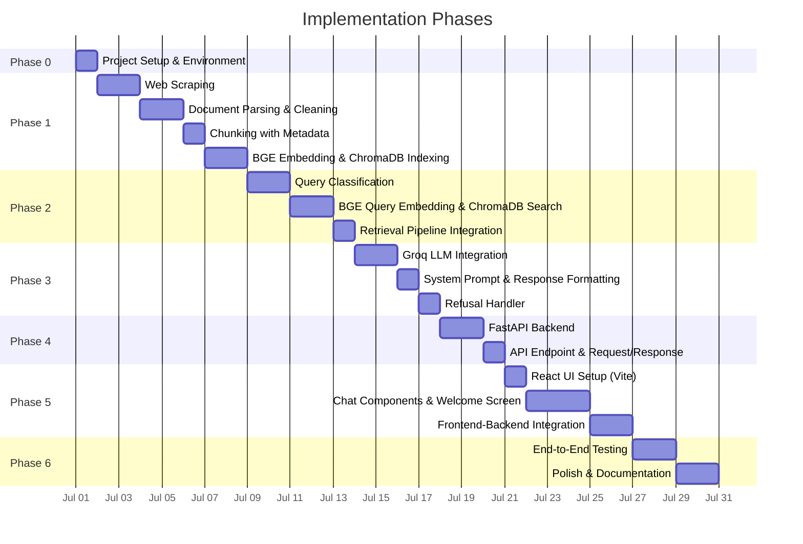

# Implementation Plan — Zero-Advice Fund RAG

> Phase-wise implementation plan derived from [architecture.md](file:///c:/Users/panka/Documents/Pankaj_CodeSpace/AI_Projects/zero-advice-fund-rag/docs/architecture.md).

---

## Phase Overview



| Phase | Name | Focus | Key Deliverable |
|-------|------|-------|-----------------|
| **0** | Project Setup | Environment, dependencies, folder structure | Working dev environment |
| **1** | Ingestion Pipeline | Scrape → Parse → Chunk → Embed → Store | ChromaDB populated with fund data |
| **2** | Retrieval Pipeline | Classify → Embed query → Search ChromaDB | Top-K relevant chunks returned |
| **3** | Generation Pipeline | Groq LLM → Format response → Refusal handler | Factual answer or polite refusal |
| **4** | Backend API | FastAPI server exposing `POST /api/query` | Working REST API |
| **5** | Frontend UI | React chat interface with Vite | Complete user-facing app |
| **6** | Testing & Polish | E2E testing, edge cases, documentation | Production-ready system |

---

## Phase 0 — Project Setup & Environment

### Objective
Set up the repository structure, virtual environment, and install all dependencies.

### Steps

| # | Task | Detail |
|---|------|--------|
| 0.1 | **Create directory structure** | Follow the proposed layout from [architecture.md](file:///c:/Users/panka/Documents/Pankaj_CodeSpace/AI_Projects/zero-advice-fund-rag/docs/architecture.md#L328-L367) |
| 0.2 | **Python virtual environment** | `python -m venv venv` → activate |
| 0.3 | **Install Python dependencies** | `pip install fastapi uvicorn requests beautifulsoup4 playwright chromadb sentence-transformers langchain groq` |
| 0.4 | **Create `urls.json`** | Store the 10 Groww fund URLs with AMC name, scheme name, and category metadata |
| 0.5 | **Create `config.py`** | Groq API key (env var), BGE model name, ChromaDB path, chunk size/overlap settings |
| 0.6 | **Create `.env` file** | `GROQ_API_KEY=<your_key>` (free tier from [console.groq.com](https://console.groq.com)) |
| 0.7 | **Initialize React frontend** | `npx -y create-vite@latest ./frontend -- --template react` |

### Files Created

```
backend/
├── config.py
├── requirements.txt
├── .env
└── scraper/
    └── urls.json
frontend/
└── (Vite scaffold)
```

### Exit Criteria
- ✅ `pip install -r requirements.txt` succeeds
- ✅ `urls.json` contains all 10 fund URLs with metadata
- ✅ Groq API key is set and testable

---

## Phase 1 — Ingestion Pipeline

> **Goal:** Scrape the 10 Groww fund pages, parse & clean the HTML, chunk the content, embed using BGE, and store in ChromaDB.

### Phase 1A — Web Scraping

| # | Task | Detail |
|---|------|--------|
| 1A.1 | **Create `scraper/scrape.py`** | Load URLs from `urls.json`, scrape each page |
| 1A.2 | **Handle JS-rendered content** | Groww pages are JS-heavy — use Playwright headless browser |
| 1A.3 | **Save raw HTML** | Store raw HTML to `scraper/raw_html/` for debugging and re-processing |
| 1A.4 | **Capture metadata** | For each page: `source_url`, `amc`, `scheme`, `category`, `scraped_at` |
| 1A.5 | **Error handling** | Retry logic, timeout handling, logging for failed URLs |

**Key file:** [scrape.py](file:///c:/Users/panka/Documents/Pankaj_CodeSpace/AI_Projects/zero-advice-fund-rag/backend/scraper/scrape.py) *(to be created)*

#### Validation
```bash
python -m backend.scraper.scrape
# Should output: "Scraped 10/10 pages successfully"
# Raw HTML files saved to backend/scraper/raw_html/
```

---

### Phase 1B — Document Parsing & Cleaning

| # | Task | Detail |
|---|------|--------|
| 1B.1 | **Create `ingestion/parser.py`** | Parse raw HTML using BeautifulSoup |
| 1B.2 | **Strip boilerplate** | Remove navigation, footer, ads, scripts, styles |
| 1B.3 | **Extract structured sections** | Identify and tag sections: `fund_overview`, `expense_ratio`, `exit_load`, `sip_details`, `risk_classification`, `benchmark`, `fund_manager`, `returns_table`, `holdings` |
| 1B.4 | **Normalize text** | Clean whitespace, fix encoding, standardize number formats |
| 1B.5 | **Output clean documents** | Each document = list of `{ section, text, source_url, amc, scheme }` |

**Key file:** [parser.py](file:///c:/Users/panka/Documents/Pankaj_CodeSpace/AI_Projects/zero-advice-fund-rag/backend/ingestion/parser.py) *(to be created)*

#### Validation
```bash
python -m backend.ingestion.parser
# Should output: parsed sections for each fund, no HTML tags in output
```

---

### Phase 1C — Chunking with Metadata

| # | Task | Detail |
|---|------|--------|
| 1C.1 | **Create `ingestion/chunker.py`** | Split parsed documents into retrieval-friendly chunks |
| 1C.2 | **Dynamic table splitting** | Large tables (e.g. Holdings) must be split by rows, prepending the table header to each chunk |
| 1C.3 | **Text splitting** | Text sections > 1000 chars split by paragraphs/sentences with overlap |
| 1C.4 | **Metadata embedding context** | Prepend fund name and section to chunk text (e.g. `[ICICI Large Cap - Holdings]`) for better BGE embedding semantic representation |
| 1C.5 | **Attach metadata to each chunk** | `chunk_id`, `source_url`, `amc`, `scheme`, `category`, `section`, `scraped_at` |
| 1C.6 | **Log chunk statistics** | Total chunks per fund, average chunk size |

**Key file:** [chunker.py](file:///c:/Users/panka/Documents/Pankaj_CodeSpace/AI_Projects/zero-advice-fund-rag/backend/ingestion/chunker.py) *(to be created)*

#### Chunk Metadata Schema
```json
{
  "chunk_id": "icici-largecap-expense-001",
  "text": "The expense ratio of ICICI Prudential Large Cap Fund...",
  "source_url": "https://groww.in/mutual-funds/icici-prudential-large-cap-fund-direct-growth",
  "amc": "ICICI Prudential",
  "scheme": "ICICI Prudential Large Cap Fund – Direct Growth",
  "category": "Large Cap",
  "section": "expense_ratio",
  "scraped_at": "2026-06-30T00:00:00Z"
}
```

#### Validation
```bash
python -m backend.ingestion.chunker
# Should output: "Generated N chunks across 10 funds (avg ~X tokens/chunk)"
```

---

### Phase 1D — BGE Embedding & ChromaDB Indexing

| # | Task | Detail |
|---|------|--------|
| 1D.1 | **Create `ingestion/embedder.py`** | Load BGE model, embed all chunks, store in ChromaDB |
| 1D.2 | **Load BGE model** | `BAAI/bge-small-en-v1.5` via `sentence-transformers` (384-dim vectors) |
| 1D.3 | **Embed chunks** | Prepend `"Represent this sentence: "` to each chunk for optimal BGE performance |
| 1D.4 | **Store in ChromaDB** | Create persistent collection, upsert embeddings + metadata |
| 1D.5 | **Verify index** | Query ChromaDB with a test question, confirm relevant chunks are returned |

**Key file:** [embedder.py](file:///c:/Users/panka/Documents/Pankaj_CodeSpace/AI_Projects/zero-advice-fund-rag/backend/ingestion/embedder.py) *(to be created)*

#### Validation
```bash
python -m backend.ingestion.embedder
# Should output: "Indexed N chunks into ChromaDB (collection: 'fund_chunks')"

# Quick sanity check:
python -c "
import chromadb
client = chromadb.PersistentClient(path='backend/vectorstore')
col = client.get_collection('fund_chunks')
print(f'Total documents: {col.count()}')
results = col.query(query_texts=['expense ratio HDFC mid cap'], n_results=3)
for doc, meta in zip(results['documents'][0], results['metadatas'][0]):
    print(f'[{meta[\"scheme\"]}] {doc[:80]}...')
"
```

### Phase 1 — Exit Criteria

- ✅ All 10 Groww pages scraped successfully
- ✅ Raw HTML parsed into clean, section-tagged text
- ✅ Chunks created with full metadata (300–500 tokens, section-aware)
- ✅ ChromaDB collection populated with BGE embeddings
- ✅ Test query returns relevant chunks

---

## Phase 2 — Retrieval Pipeline

> **Goal:** Build the query-side pipeline — classify incoming queries, embed them using BGE, and retrieve the most relevant chunks from ChromaDB.

### Phase 2A — Query Classification

| # | Task | Detail |
|---|------|--------|
| 2A.1 | **Create `query/classifier.py`** | Classify user queries into `FACTUAL`, `ADVISORY`, or `PII` |
| 2A.2 | **Rule-based patterns** | Keyword matching for advisory queries: `"should I"`, `"better"`, `"recommend"`, `"which fund"`, `"invest"` |
| 2A.3 | **PII detection** | Regex patterns for PAN (`[A-Z]{5}[0-9]{4}[A-Z]`), Aadhaar (`\d{4}\s?\d{4}\s?\d{4}`), phone, email, account numbers |
| 2A.4 | **Return classification** | `{ "type": "FACTUAL" | "ADVISORY" | "PII", "query": "..." }` |
| 2A.5 | **Unit tests** | Test with 10+ factual, 10+ advisory, and 5+ PII queries |

**Key file:** [classifier.py](file:///c:/Users/panka/Documents/Pankaj_CodeSpace/AI_Projects/zero-advice-fund-rag/backend/query/classifier.py) *(to be created)*

#### Test Cases

| Query | Expected |
|-------|----------|
| "What is the expense ratio of HDFC Mid-Cap Fund?" | `FACTUAL` |
| "Should I invest in ICICI Flexicap?" | `ADVISORY` |
| "Which fund is better for long term?" | `ADVISORY` |
| "My PAN is ABCDE1234F" | `PII` |
| "What is the exit load?" | `FACTUAL` |
| "Recommend a fund for me" | `ADVISORY` |

---

### Phase 2B — BGE Query Embedding & ChromaDB Search

| # | Task | Detail |
|---|------|--------|
| 2B.1 | **Create `query/retriever.py`** | Embed user query with BGE → search ChromaDB → return top-K chunks |
| 2B.2 | **Query embedding** | Use same `BAAI/bge-small-en-v1.5` model as ingestion (prepend `"Represent this sentence for searching relevant passages: "` to query) |
| 2B.3 | **Similarity search** | Cosine similarity via ChromaDB's `.query()` method |
| 2B.4 | **Top-K parameter** | Default: **top 3–5 chunks** |
| 2B.5 | **Metadata filtering** | If a specific AMC or scheme name is detected in the query, apply `where` filter |
| 2B.6 | **Return format** | List of `{ text, source_url, amc, scheme, section, score }` |

**Key file:** [retriever.py](file:///c:/Users/panka/Documents/Pankaj_CodeSpace/AI_Projects/zero-advice-fund-rag/backend/query/retriever.py) *(to be created)*

#### Validation
```bash
python -c "
from backend.query.retriever import retrieve
results = retrieve('What is the expense ratio of ICICI Prudential Large Cap Fund?')
for r in results:
    print(f'[{r[\"scheme\"]}] score={r[\"score\"]:.3f} | {r[\"text\"][:80]}...')
"
# Top result should be from the ICICI Large Cap expense_ratio section
```

---

### Phase 2C — Retrieval Pipeline Integration

| # | Task | Detail |
|---|------|--------|
| 2C.1 | **Wire classifier → retriever** | If `FACTUAL` → call retriever; if `ADVISORY/PII` → skip retrieval |
| 2C.2 | **Create `query/pipeline.py`** | Unified function: `process_query(question) → { type, chunks[] }` |
| 2C.3 | **Handle edge cases** | Empty query, very short query, no relevant chunks found |

**Key file:** [pipeline.py](file:///c:/Users/panka/Documents/Pankaj_CodeSpace/AI_Projects/zero-advice-fund-rag/backend/query/pipeline.py) *(to be created)*

### Phase 2 — Exit Criteria

- ✅ Classifier correctly routes factual, advisory, and PII queries
- ✅ BGE query embedding + ChromaDB search returns relevant chunks
- ✅ Metadata filters work for AMC/scheme-specific queries
- ✅ Pipeline function integrates classification → retrieval

---

## Phase 3 — Generation Pipeline

> **Goal:** Use Groq LLM to generate concise, source-backed answers from retrieved chunks, and handle refusals gracefully.

### Phase 3A — Groq LLM Integration

| # | Task | Detail |
|---|------|--------|
| 3A.1 | **Create `query/generator.py`** | Integrate Groq API for LLM generation |
| 3A.2 | **Install Groq SDK** | `pip install groq` |
| 3A.3 | **Initialize Groq client** | Load API key from `.env` / environment variable |
| 3A.4 | **Model selection** | Primary: `llama-3.3-70b-versatile`; Fallback: `mixtral-8x7b-32768` |
| 3A.5 | **Basic generation test** | Send a simple prompt, verify response is returned |
| 3A.6 | **Rate limit handling** | Implement retry with exponential backoff for Groq free tier limits |

**Key file:** [generator.py](file:///c:/Users/panka/Documents/Pankaj_CodeSpace/AI_Projects/zero-advice-fund-rag/backend/query/generator.py) *(to be created)*

#### Validation
```bash
python -c "
from groq import Groq
client = Groq()
response = client.chat.completions.create(
    model='llama-3.3-70b-versatile',
    messages=[{'role': 'user', 'content': 'Say hello'}],
    temperature=0.1
)
print(response.choices[0].message.content)
"
# Should print a greeting — confirms Groq API key and connectivity
```

---

### Phase 3B — System Prompt & Response Formatting

| # | Task | Detail |
|---|------|--------|
| 3B.1 | **Define system prompt** | Facts-only rules, 3-sentence limit, citation format, footer format |
| 3B.2 | **Build prompt template** | Inject `{retrieved_chunks}` and `{user_query}` into the template |
| 3B.3 | **Format retrieved chunks** | Serialize top-K chunks into the prompt with source metadata |
| 3B.4 | **Parse LLM response** | Extract answer text, validate citation link exists, ensure footer present |
| 3B.5 | **Response schema** | `{ status, type, answer, source_url, last_updated }` |

#### System Prompt

```text
You are a facts-only mutual fund FAQ assistant. You MUST:
1. Answer ONLY from the provided context. Never fabricate information.
2. Keep your response to a MAXIMUM of 3 sentences.
3. Include EXACTLY ONE citation link (the source_url from the context).
4. End every response with: "Last updated from sources: <scraped_at date> <source_url>"
5. NEVER provide investment advice, opinions, or recommendations.
6. NEVER compare fund performance or calculate returns.
7. If the context does not contain the answer, say so honestly.

CONTEXT:
{retrieved_chunks}

USER QUESTION:
{user_query}
```

#### LLM Call Parameters

| Parameter | Value |
|-----------|-------|
| `model` | `llama-3.3-70b-versatile` |
| `temperature` | `0.1` |
| `max_tokens` | `300` |
| `top_p` | `0.9` |

---

### Phase 3C — Refusal Handler

| # | Task | Detail |
|---|------|--------|
| 3C.1 | **Create refusal templates** | Advisory refusal, PII refusal |
| 3C.2 | **Advisory refusal message** | Polite decline + facts-only reminder + AMFI link |
| 3C.3 | **PII refusal message** | Privacy-focused decline + no logging of original query |
| 3C.4 | **No-context refusal** | When retrieval returns no relevant chunks |
| 3C.5 | **Wire into pipeline** | Classifier → Refusal Handler → formatted response |

#### Refusal Templates

**Advisory:**
```
I can only provide factual information about mutual fund schemes, such as expense
ratios, exit loads, or SIP minimums. I'm unable to offer investment advice or
recommendations. For investment guidance, visit AMFI (https://www.amfiindia.com/)
or consult a SEBI-registered financial advisor.
```

**PII:**
```
For your safety, I cannot process queries containing personal information like
PAN, Aadhaar, or account numbers. Please remove any personal details and ask a
factual question about mutual fund schemes.
```

**No context:**
```
I don't have enough information in my sources to answer this question accurately.
Please try rephrasing, or visit the fund page directly for details.
```

### Phase 3 — Exit Criteria

- ✅ Groq LLM generates answers from retrieved chunks
- ✅ Responses follow the 3-sentence + 1-citation + footer format
- ✅ Temperature is low (0.1) for factual accuracy
- ✅ Refusal handler returns appropriate messages for advisory/PII/no-context
- ✅ Full pipeline: query → classify → retrieve → generate → formatted response

---

## Phase 4 — Backend API (FastAPI)

> **Goal:** Expose the entire query pipeline as a REST API.

### Phase 4A — FastAPI Server Setup

| # | Task | Detail |
|---|------|--------|
| 4A.1 | **Create `api/main.py`** | FastAPI app with CORS middleware |
| 4A.2 | **Health check endpoint** | `GET /api/health` → `{ "status": "ok" }` |
| 4A.3 | **Load models on startup** | BGE model + ChromaDB client initialized at app startup (not per-request) |
| 4A.4 | **CORS configuration** | Allow `http://localhost:5173` (Vite dev server) |

### Phase 4B — Query Endpoint

| # | Task | Detail |
|---|------|--------|
| 4B.1 | **`POST /api/query`** | Accept `{ "question": "..." }`, return formatted response |
| 4B.2 | **Request validation** | Reject empty questions, enforce max length |
| 4B.3 | **Wire to pipeline** | `request.question` → `process_query()` → `generate()` → JSON response |
| 4B.4 | **Error handling** | Graceful handling of Groq API errors, ChromaDB failures |
| 4B.5 | **Response schema** | Factual: `{ status, type, answer, source_url, last_updated }`; Refusal: `{ status, type, answer, educational_link }` |

**Key file:** [main.py](file:///c:/Users/panka/Documents/Pankaj_CodeSpace/AI_Projects/zero-advice-fund-rag/backend/api/main.py) *(to be created)*

#### Validation
```bash
# Start server
uvicorn backend.api.main:app --reload --port 8000

# Test health
curl http://localhost:8000/api/health

# Test factual query
curl -X POST http://localhost:8000/api/query \
  -H "Content-Type: application/json" \
  -d '{"question": "What is the expense ratio of HDFC Mid-Cap Fund?"}'

# Test advisory refusal
curl -X POST http://localhost:8000/api/query \
  -H "Content-Type: application/json" \
  -d '{"question": "Should I invest in ICICI Flexicap?"}'
```

### Phase 4 — Exit Criteria

- ✅ FastAPI server starts and serves `GET /api/health`
- ✅ `POST /api/query` returns factual answers with citations
- ✅ Advisory queries return polite refusals
- ✅ CORS allows React dev server origin
- ✅ Models loaded once at startup, not per-request

---

## Phase 5 — Frontend UI (React + Vite)

> **Goal:** Build a clean, professional chat interface with disclaimers and example questions.

### Phase 5A — React Project Setup

| # | Task | Detail |
|---|------|--------|
| 5A.1 | **Scaffold Vite project** | `npx -y create-vite@latest ./frontend -- --template react` |
| 5A.2 | **Install dependencies** | `npm install` |
| 5A.3 | **Configure proxy** | Vite proxy `/api` → `http://localhost:8000` |
| 5A.4 | **Set up `index.css`** | Design system: colors, fonts (Google Fonts), spacing, dark mode |

### Phase 5B — Chat Components

| # | Component | Responsibility |
|---|-----------|----------------|
| 5B.1 | **`App.jsx`** | Root layout — header, main area, footer |
| 5B.2 | **`DisclaimerBanner.jsx`** | Persistent banner: *"Facts-only. No investment advice."* |
| 5B.3 | **`WelcomeScreen.jsx`** | Short intro + 3 clickable example questions |
| 5B.4 | **`ChatWindow.jsx`** | Scrollable message history container |
| 5B.5 | **`MessageBubble.jsx`** | User message bubble + assistant response card (with citation + footer) |
| 5B.6 | **`QueryInput.jsx`** | Text input + send button; disabled during loading |

#### Example Questions (Welcome Screen)

1. *"What is the expense ratio of ICICI Prudential Large Cap Fund?"*
2. *"What is the exit load for HDFC Small Cap Fund?"*
3. *"What is the minimum SIP amount for ICICI Prudential ELSS Tax Saver?"*

### Phase 5C — Frontend-Backend Integration

| # | Task | Detail |
|---|------|--------|
| 5C.1 | **API service layer** | `api.js` — `postQuery(question)` → `fetch('/api/query', ...)` |
| 5C.2 | **Loading state** | Show typing indicator while waiting for backend |
| 5C.3 | **Render factual responses** | Display answer + clickable citation link + "Last updated" footer |
| 5C.4 | **Render refusal responses** | Display refusal message + educational link |
| 5C.5 | **Error handling** | Network errors, server errors → user-friendly error message |

### Phase 5 — Exit Criteria

- ✅ Welcome screen displays with intro + 3 example questions
- ✅ Clicking an example question sends it as a query
- ✅ Factual responses render with citation and footer
- ✅ Refusal responses render with educational link
- ✅ Disclaimer banner is always visible
- ✅ UI is responsive, clean, and professional

---

## Phase 6 — Testing, Polish & Documentation

> **Goal:** Validate the full system end-to-end, fix edge cases, and write documentation.

### Phase 6A — End-to-End Testing

| # | Test | Detail |
|---|------|--------|
| 6A.1 | **Factual accuracy** | Test 10+ factual queries → verify answers match Groww page data |
| 6A.2 | **Citation validity** | Every response has a valid, clickable Groww URL |
| 6A.3 | **Footer format** | Every response ends with `"Last updated from sources: <date> <url>"` |
| 6A.4 | **Advisory refusal** | Test 10+ advisory queries → all correctly refused |
| 6A.5 | **PII refusal** | Test with PAN, Aadhaar, email → all correctly refused, not logged |
| 6A.6 | **Edge cases** | Empty query, gibberish, very long query, query about a fund not in corpus |
| 6A.7 | **Cross-AMC queries** | "Compare expense ratios" → should refuse (performance comparison) |

### Phase 6B — Polish & Documentation

| # | Task | Detail |
|---|------|--------|
| 6B.1 | **README.md** | Setup instructions, architecture overview, selected AMC/schemes, known limitations |
| 6B.2 | **Environment docs** | `.env.example` with required variables |
| 6B.3 | **UI polish** | Consistent styling, smooth animations, loading states |
| 6B.4 | **Error messages** | User-friendly fallbacks for all failure modes |
| 6B.5 | **Code cleanup** | Remove debug prints, add docstrings, format with black/prettier |

### Phase 6 — Exit Criteria

- ✅ All factual queries return accurate, cited answers
- ✅ All advisory/PII queries are properly refused
- ✅ README is complete and someone can run the project from scratch
- ✅ UI is polished and professional
- ✅ No PII is stored or logged anywhere

---

## Full File Checklist

| Phase | File | Purpose |
|-------|------|---------|
| 0 | `backend/config.py` | Centralized config (API keys, model names, paths) |
| 0 | `backend/requirements.txt` | Python dependencies |
| 0 | `backend/.env` | Environment variables (Groq API key) |
| 0 | `backend/scraper/urls.json` | 10 Groww fund URLs + metadata |
| 1A | `backend/scraper/scrape.py` | Web scraper (Playwright) |
| 1B | `backend/ingestion/parser.py` | HTML → clean text |
| 1C | `backend/ingestion/chunker.py` | Text → chunks with metadata |
| 1D | `backend/ingestion/embedder.py` | Chunks → BGE vectors → ChromaDB |
| 2A | `backend/query/classifier.py` | Factual / Advisory / PII classifier |
| 2B | `backend/query/retriever.py` | BGE query embedding + ChromaDB search |
| 2C | `backend/query/pipeline.py` | Unified classify → retrieve pipeline |
| 3A | `backend/query/generator.py` | Groq LLM integration |
| 3C | `backend/query/refusal.py` | Refusal message templates |
| 4 | `backend/api/main.py` | FastAPI app (`POST /api/query`) |
| 5A | `frontend/src/index.css` | Design system (colors, fonts, layout) |
| 5B | `frontend/src/App.jsx` | Root component |
| 5B | `frontend/src/components/DisclaimerBanner.jsx` | Disclaimer banner |
| 5B | `frontend/src/components/WelcomeScreen.jsx` | Welcome + example questions |
| 5B | `frontend/src/components/ChatWindow.jsx` | Message history |
| 5B | `frontend/src/components/MessageBubble.jsx` | User/assistant message cards |
| 5B | `frontend/src/components/QueryInput.jsx` | Query input bar |
| 5C | `frontend/src/api.js` | API service layer |
| 6B | `README.md` | Project documentation |

---

*Derived from [architecture.md](file:///c:/Users/panka/Documents/Pankaj_CodeSpace/AI_Projects/zero-advice-fund-rag/docs/architecture.md)*
